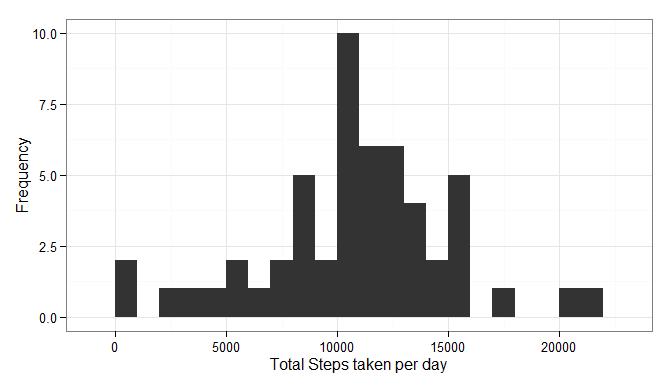
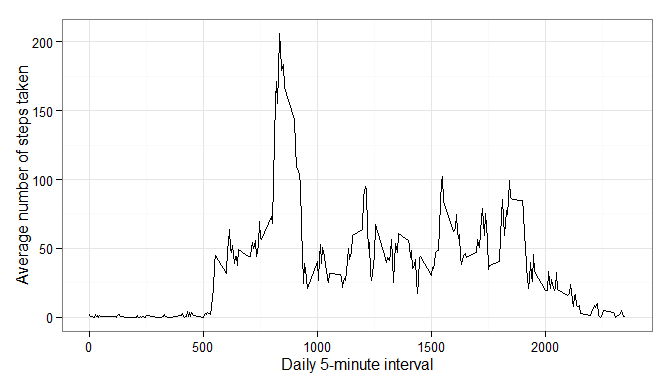
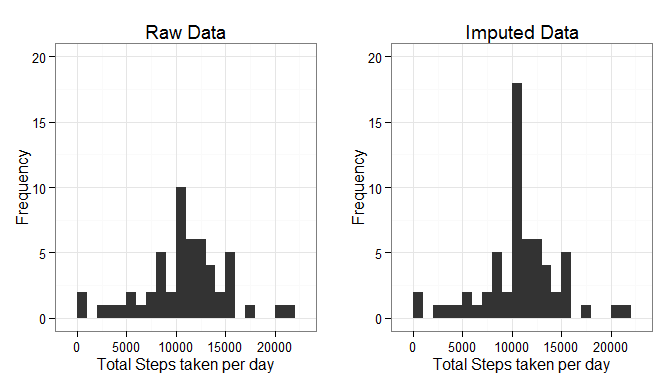
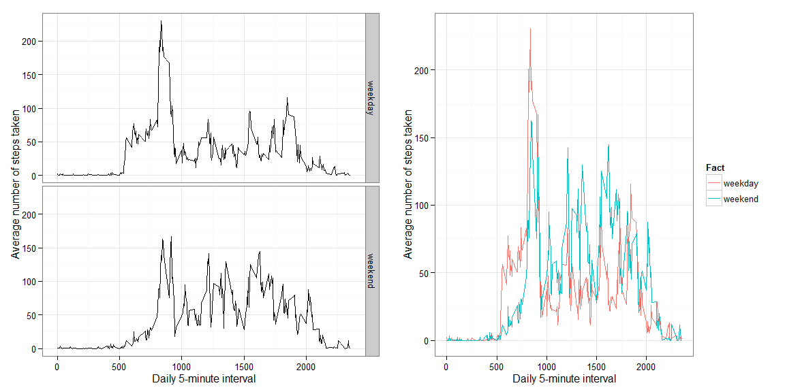

# Reproducible Research: Peer Assessment 1
## Introduction

The following packages were used for the assignment.


```r
library(dplyr)
library(ggplot2)
library(knitr)
library(gridExtra)
```

Before starting we first need to make sure that all the code will be shown 
and assign some figure display parameters.


```r
opts_chunk$set(echo=TRUE,fig.height = 4,fig.width = 7,fig.align = 'center')
```

## Loading and preprocessing the data

The primary aim of this section is to:

1. Assign the working directory to the cloned repository.


```r
setwd("C:/Users/212410226/Python & R/R_workingDirectory/4. Reproducible research/Week 2/Project/RepData_PeerAssessment1")
```

2. Read the data and store it in a data frame variable called **Data**.


```r
Data <- read.csv(unz("activity.zip","activity.csv"), stringsAsFactors = FALSE)
```

3. Display the first six entries that does not have **NA** or **zero** entries.


```r
head(Data[!is.na(Data$steps) & Data$steps!= 0,])
```

```
##     steps       date interval
## 555   117 2012-10-02     2210
## 556     9 2012-10-02     2215
## 627     4 2012-10-03      410
## 631    36 2012-10-03      430
## 644    25 2012-10-03      535
## 647    90 2012-10-03      550
```

## What is mean total number of steps taken per day?

For this part of the assignment the NA values in the data set was ignored.

####1. Calculate the total number of steps taken per day

The **dplyr** package was used to filter/remove **NA** entries, group it according to the date variable and
finally sum the number of steps taken each day.


```r
TotalStepsPerDay <- Data %>%
                    filter(!is.na(steps)) %>%
                    group_by(date) %>%
                    summarise(TotalSteps = sum(steps))
```

####2. Make a histogram of the total number of steps taken each day

The **ggplot2** package was used to generate the histogram.


```r
ggplot(TotalStepsPerDay) + theme_bw() + 
        geom_histogram(aes(TotalSteps),binwidth=1000) + 
        xlab('Total Steps taken per day') +
        ylab('Frequency')
```



####3. Calculate and report the mean and median of the total number of steps taken per day


```r
MeanSteps    <- format(mean(TotalStepsPerDay$TotalSteps),trim=TRUE)
MedianSteps  <- format(median(TotalStepsPerDay$TotalSteps),trim=TRUE)
```

The mean steps taken each day is **10766.19**, while the median value is **10765**.

## What is the average daily activity pattern?

####1. Make a time series plot of the 5-minute interval (x-axis) and the average number of steps taken, averaged across all days (y-axis)

The **dplyr** package was used to filter/remove **NA** entries, group it according to the interval variable and
finally take the mean for each interval for all the days.


```r
DailyActivityPatern <- Data %>%
                       filter(!is.na(steps)) %>%
                       group_by(interval) %>%
                       summarise(AvgSteps = mean(steps))
```

The **ggplot2** package was used to generate the time series plot.


```r
ggplot(DailyActivityPatern) + theme_bw() + 
geom_line(aes(interval,AvgSteps)) + 
xlab('Daily 5-minute interval') +
ylab('Average number of steps taken')
```



####2. Which 5-minute interval, on average across all the days in the dataset, contains the maximum number of steps?


```r
max_value    <- max(DailyActivityPatern$AvgSteps)
max_interval <- DailyActivityPatern$interval[DailyActivityPatern$AvgSteps == max_value]
```

The 5-minute interval, on average across all the days in the dataset, that contains the maximum number of steps is **835 minutes**.

## Imputing missing values

####1. Calculate and report the total number of missing values in the dataset (i.e. the total number of rows with NAs)


```r
TotalNASteps    <- length(which(is.na(Data$steps)))
TotalNADate     <- length(which(is.na(Data$date)))
TotalNAInterval <- length(which(is.na(Data$interval)))
```

The total number of missing entries for the steps variable is **2304**, while there was no missing entries for the date and interval variables.

####2. Devise a strategy for filling in all of the missing values in the dataset. The strategy does not need to be sophisticated. For example, you could use the mean/median for that day, or the mean for that 5-minute interval, etc.

The strategy decided upon was to use the mean for that specific 5 minute interval to replace the NA value.

####3. Create a new dataset that is equal to the original dataset but with the missing data filled in.

The following code generates a vector with index locations of the **NA entries** and uses a for loop to impute the average values on a new data frame called **Imp_Data**. 


```r
NA_locations <- which(is.na(Data$steps))
Imp_Data <- data.frame(Data)

for(i in NA_locations){
        Imp_Data[i,1] <- DailyActivityPatern$AvgSteps[Imp_Data[i,3] == DailyActivityPatern$interval]
}
```

####4. Make a histogram of the total number of steps taken each day and Calculate and report the mean and median total number of steps taken per day. Do these values differ from the estimates from the first part of the assignment? What is the impact of imputing missing data on the estimates of the total daily number of steps?

The code below calculates total steps taken per day for the imputed data set and plot histograms for the Raw as well as imputed data with ggplot2. A table is also generated showing the Mean and Median for the Raw and Imputed data.


```r
Imp_TotalStepsPerDay <- Imp_Data %>%
                        group_by(date) %>%
                        summarise(TotalSteps = sum(steps))

p1 <-   ggplot(TotalStepsPerDay) + theme_bw() + 
        geom_histogram(aes(TotalSteps),binwidth=1000) + 
        ylim(0,20) +
        xlab('Total Steps taken per day') +
        ylab('Frequency') +
        ggtitle('Raw Data')

p2 <-   ggplot(Imp_TotalStepsPerDay) + theme_bw() + 
        geom_histogram(aes(TotalSteps),binwidth=1000) +
        ylim(0,20) +
        xlab('Total Steps taken per day') +
        ylab('Frequency') +
        ggtitle('Imputed Data')

Imp_MeanSteps    <- format(mean(Imp_TotalStepsPerDay$TotalSteps),trim=TRUE)
Imp_MedianSteps  <- format(median(Imp_TotalStepsPerDay$TotalSteps),trim=TRUE)

stat_Tabele      <- data.frame(Mean   = c(MeanSteps,  Imp_MeanSteps), 
                               Median = c(MedianSteps,Imp_MedianSteps))
rownames(stat_Tabele) <- c('RawData', 'Imputed Data')
grid.arrange(p1,p2, ncol = 2)
```



```r
kable(stat_Tabele, format = "pandoc", digits=3, caption = ' ', align = 'c')
```


Table:  

                  Mean       Median  
-------------  ----------  ----------
RawData         10766.19     10765   
Imputed Data    10766.19    10766.19 

Referring to the histograms and table it seems like imputing the missing values did not have a significant effect on the mean and median. The total daily number of steps, however, increases due to the added values, especially around the mean.

## Are there differences in activity patterns between weekdays and weekends?

####1. Create a new factor variable in the dataset with two levels - "weekday" and "weekend" indicating whether a given date is a weekday or weekend day.

This was done using the following script and aggregated accordingly.


```r
Imp_Data$Fact <- weekdays(as.POSIXlt(Imp_Data$date, tz = 'UTC'))
Imp_Data$Fact <- factor(ifelse(Imp_Data$Fact=="Sunday"|Imp_Data$Fact=="Saturday","weekend","weekday"))

Imp_DailyActivityPatern <- Imp_Data %>%
                           group_by(Fact,interval) %>%
                           summarise(AvgSteps = mean(steps))
```

####2. Make a panel plot containing a time series plot (i.e. type = "l") of the 5-minute interval (x-axis) and the average number of steps taken, averaged across all weekday days or weekend days (y-axis).

ggplot2 was used to generate the plots. The one on the left was required, but I think the one on the right is a bit better for comparison. 


```r
p1 <-   ggplot(Imp_DailyActivityPatern) + theme_bw() +
        geom_line(aes(interval,AvgSteps)) + 
        facet_grid(Fact~.) +
        xlab('Daily 5-minute interval') +
        ylab('Average number of steps taken')

p2 <-   ggplot(Imp_DailyActivityPatern) + theme_bw() +
        geom_line(aes(interval,AvgSteps,col = Fact)) + 
        xlab('Daily 5-minute interval') +
        ylab('Average number of steps taken')
grid.arrange(p1,p2, ncol = 2)
```


